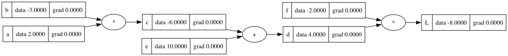
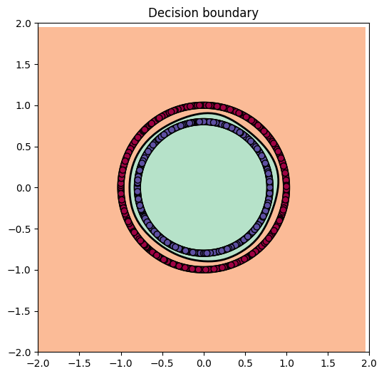

# Micrograd
 
A tiny autodiff engine built from scratch, inspired by [Andrej Karpathy's micrograd](https://github.com/karpathy/micrograd) — implemented here as a learning exercise to understand exactly how backpropagation and neural network training work under the hood, with none of the machinery hidden behind a library like PyTorch.
 

 
## Overview
 
This project is for educational purposes. It's a scalar-valued autodiff engine that mirrors the core idea behind PyTorch's API: build a computational graph out of mathematical expressions, run a forward pass, then run a backward pass to compute gradients via the chain rule.
 
The key difference from PyTorch: PyTorch operates on tensors (n-dimensional arrays) for speed and vectorization. Here, the `Value` class wraps a single scalar number at a time. Every operation (`+`, `*`, `sigmoid`, `log`, `relu`, ...) is overloaded on `Value` so that using ordinary Python arithmetic silently builds a graph of every operation performed, alongside the local derivative rule needed to differentiate it later.

## How it works
 
- **`Value`** — wraps one number and records how it was produced (its "children" and the operation). Each operation defines its own local backward rule (e.g. `d(a*b)/da = b`).
- **Forward pass** — chaining `Value` operations together (e.g. through a neural network) builds a directed acyclic graph (DAG) connecting inputs to a final output.
- **Backward pass** — calling `.backward()` on the final output performs a topological sort of the graph, seeds the root gradient at `1.0`, and walks backward applying the chain rule at each node, accumulating gradients (`+=`) into every `Value` involved — including every weight and bias in the network.
- **`nn.py`** — a minimal `Neuron` / `Layer` / `MLP` library built entirely out of `Value` operations. Because every operation inside a neuron is a `Value` op, the entire forward pass of a network — no matter how many layers — automatically builds a graph, and a single `.backward()` call computes gradients for every parameter with no special-casing for "this is a neural net."
## Computational graph
 

 
## Demo: classifying two circles
 
To test the engine end-to-end, I trained a small MLP on the classic `make_circles` toy dataset — two interleaved circles that aren't linearly separable — and used it as a binary classification problem.
 
- **Architecture**: `MLP(2, [16, 16, 1])` — 2 inputs, two hidden layers of 16 tanh neurons, and a single linear output neuron producing a raw logit.
- **Loss**: binary cross-entropy (BCE), computed by hand on top of `Value.sigmoid()` and `Value.log()`, since the raw logit is passed through sigmoid to get a probability before computing loss.
- **Training loop**: `forward → loss → zero_grad → backward → update`, using plain gradient descent (`param.data -= lr * param.grad`) — no optimizer library involved.
- **Key constraint**: since `Value` only operates on individual scalars (not batched arrays), each example in a batch has to be forward-passed through the network one at a time in a Python loop, and the per-example losses are then averaged into a single scalar before calling `.backward()`.
After training, the model successfully learns a non-linear decision boundary that separates the two circles — something a single linear layer couldn't do, confirming that both the autodiff engine and the network built on top of it are working correctly end to end.


 
## Project structure
 
```
.
├── engine.py     # the Value class: scalar autodiff engine
├── nn.py         # Neuron, Layer, MLP built on top of Value
├── demo.ipynb    # training + decision boundary visualization on make_circles
├── helper.py    # the function to draw the computation graph 
└── README.md
``